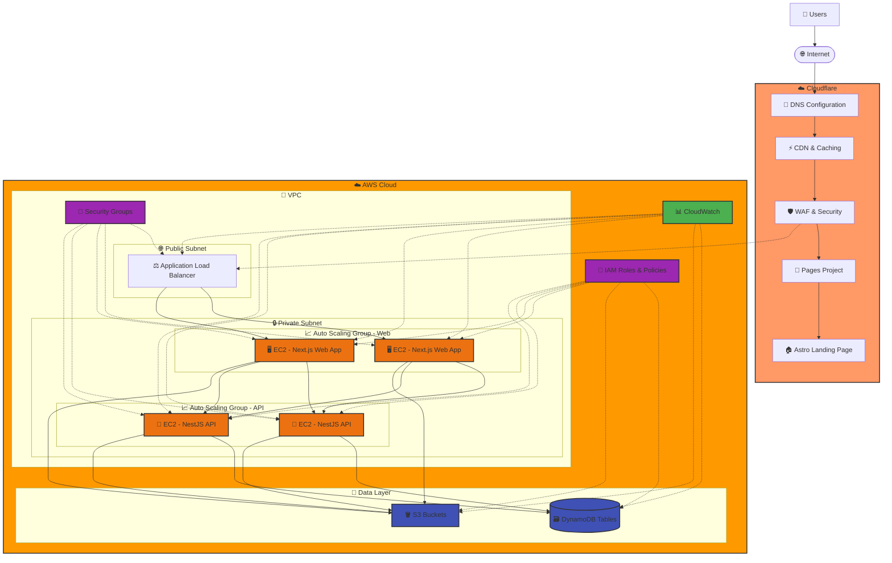

# Infrastructure Schema (simple)

A minimal infrastructure diagram showing essential components and their interactions.

```mermaid
graph TB
    %% External Users and DNS
    Users[👥 Users]
    Internet([🌐 Internet])
    
    %% Cloudflare Infrastructure
    subgraph Cloudflare ["☁️ Cloudflare"]
        CF_DNS[🔗 DNS Configuration]
        CF_CDN[⚡ CDN & Caching]
        CF_WAF[🛡️ WAF & Security]
        CF_Pages[📄 Pages Project]
        Landing[🏠 Astro Landing Page]
    end
    
    %% AWS Infrastructure
    subgraph AWS ["☁️ AWS Cloud"]
        %% VPC and Networking
        subgraph VPC ["🏢 VPC"]
            subgraph PublicSubnet ["🌐 Public Subnet"]
                ALB[⚖️ Application Load Balancer]
            end
            
            subgraph PrivateSubnet ["🔒 Private Subnet"]
                subgraph ASG_Web ["📈 Auto Scaling Group - Web"]
                    EC2_Web1[🖥️ EC2 - Next.js Web App]
                    EC2_Web2[🖥️ EC2 - Next.js Web App]
                end
                
                subgraph ASG_API ["📈 Auto Scaling Group - API"]
                    EC2_API1[🔧 EC2 - NestJS API]
                    EC2_API2[🔧 EC2 - NestJS API]
                end
            end
            
            SG[🔐 Security Groups]
        end
        
        %% Data Layer
        subgraph DataLayer ["💾 Data Layer"]
            DynamoDB[(🗃️ DynamoDB Tables)]
            S3[🪣 S3 Buckets]
        end
        
        %% Monitoring and Security
        CloudWatch[📊 CloudWatch]
        IAM[🔑 IAM Roles & Policies]
    end
    
    %% User Traffic Flow
    Users --> Internet
    Internet --> CF_DNS
    CF_DNS --> CF_CDN
    CF_CDN --> CF_WAF
    
    %% Landing Page Flow
    CF_WAF --> CF_Pages
    CF_Pages --> Landing
    
    %% Web Application Flow
    CF_WAF -.-> ALB
    ALB --> EC2_Web1
    ALB --> EC2_Web2
    
    %% API Communication
    EC2_Web1 --> EC2_API1
    EC2_Web2 --> EC2_API1
    EC2_Web1 --> EC2_API2
    EC2_Web2 --> EC2_API2
    
    %% Data Access
    EC2_API1 --> DynamoDB
    EC2_API2 --> DynamoDB
    EC2_Web1 --> S3
    EC2_Web2 --> S3
    EC2_API1 --> S3
    EC2_API2 --> S3
    
    %% Security and Monitoring
    IAM -.-> EC2_Web1
    IAM -.-> EC2_Web2
    IAM -.-> EC2_API1
    IAM -.-> EC2_API2
    IAM -.-> DynamoDB
    IAM -.-> S3
    
    CloudWatch -.-> EC2_Web1
    CloudWatch -.-> EC2_Web2
    CloudWatch -.-> EC2_API1
    CloudWatch -.-> EC2_API2
    CloudWatch -.-> DynamoDB
    CloudWatch -.-> S3
    CloudWatch -.-> ALB
    
    SG -.-> ALB
    SG -.-> EC2_Web1
    SG -.-> EC2_Web2
    SG -.-> EC2_API1
    SG -.-> EC2_API2
    
    %% Styling
    classDef cloudflare fill:#f96,stroke:#333,stroke-width:2px
    classDef aws fill:#ff9900,stroke:#333,stroke-width:2px
    classDef ec2 fill:#ec7211,stroke:#333,stroke-width:2px
    classDef data fill:#3f51b5,stroke:#333,stroke-width:2px
    classDef monitor fill:#4caf50,stroke:#333,stroke-width:2px
    classDef security fill:#9c27b0,stroke:#333,stroke-width:2px
    
    class Cloudflare cloudflare
    class AWS aws
    class EC2_Web1,EC2_Web2,EC2_API1,EC2_API2 ec2
    class DynamoDB,S3 data
    class CloudWatch monitor
    class IAM,SG security
```
